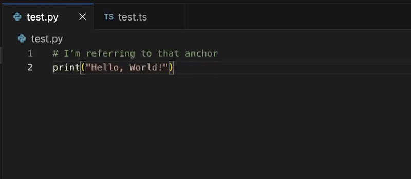
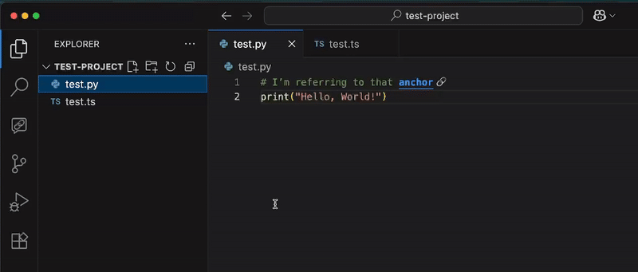

## 💬 Comment Linking extension for VS Code

<p align="center">
  
</p>

<p align="center">
  <a href="https://marketplace.visualstudio.com/items?itemName=kratiuk.commentlinking">
    
  </a>
  <a href="https://marketplace.visualstudio.com/items?itemName=kratiuk.commentlinking">
    
  </a>
  <a href="https://marketplace.visualstudio.com/items?itemName=kratiuk.commentlinking">
    
  </a>
</p>

<p align="center">
  <a href="https://open-vsx.org/extension/kratiuk/commentlinking">
    
  </a>
  <a href="https://open-vsx.org/extension/kratiuk/commentlinking">
    
  </a>
  <a href="https://open-vsx.org/extension/kratiuk/commentlinking">
    
  </a>
</p>

<p align="center">
  <a href="https://github.com/kratiuk/commentlinks/blob/master/LICENSE">
    
  </a>
</p>

`🔗 Link between comments in code. Create anchors and jump to them from anywhere`

### 🎬 Examples
- Basic Link ↔ Anchor interaction:

  

- Anchors view (tree of all anchors):

  

### ✅ Supported languages and file formats
- `JavaScript` (.js)
- `TypeScript` (.ts)
- `Python` (.py)
- `JSON` (.json)
- `JSON With Comments` (.jsonc)
- `Markdown` (.md) - full text support with special syntax

### 🧠 How it works
- Add an anchor comment where you want to jump to: `// [MyAnchor](#id)`
- Reference it elsewhere: `// [Go to anchor](id)`
- Click the link to jump to the anchor. The Anchors view shows all anchors across your workspace.

### 📝 Syntax variations
#### In code comments (JS/TS/Python/JSON):
- **Create anchor:** `// [MyAnchor](#myId)`
- **Link to anchor:** `// [Go to anchor](myId)`

#### In Markdown files:
- **Create anchor:** `[MyAnchor](<>#myId)`
- **Link to anchor:** `[Go to anchor](<>myId)`
- **Cross-reference:** Markdown can link to anchors in code comments and vice versa

### ⚙️ Custom File Types
You can extend support to any file type by configuring custom comment syntax in VS Code settings:

**Open Settings** → Search for `commentLinking.customFileTypes` **OR** directly edit your `settings.json` file

```json
{
  "commentLinking.customFileTypes": {
    ".vue": "js",
    ".go": "js", 
    ".sh": "python",
    ... other extensions you want to add support for ...
  }
}
```

**Configuration format:**
- **Key** (e.g. `".vue"`) - File extension to add support for
- **Value** - Comment syntax type to use:
  - `"js"` - Uses `//` comments (like JavaScript/TypeScript)
  - `"python"` - Uses `#` comments (like Python/Shell)

**Here's how it would work for `.go` files:**
```go
// [MyGoAnchor](#goExample) - This works in .go files
// [Link to anchor](goExample)
```

### 📂 Indexing scope & exclusions
- Scans all workspace folders for supported file extensions
- Excludes by default:
  - `node_modules/`
  - any dot-directories (names starting with a dot), e.g. `.git/`, `.vscode/`, `.cache/`

### ✨ Features
- 🔍 Anchors tree view to browse anchors across files
- 🎯 Inline links in comments that jump to anchors
- 🖍️ Smart decorations to highlight only the preview text
- 📋 Copy anchor ID from the Anchors view

### 📦 Installation
1. Install the extension
2. Reload VS Code window (you’ll be prompted on first install)

### 🧪 Development & Testing
To test changes during development:
1. Press `F5` to launch Extension Development Host
2. Make changes to the code and save
3. In the test window, run `Developer: Reload Window` to see updates

### ✅ Roadmap / To‑Do
- [ ] 🧵 Support multiline comments (block and triple-quote styles)
- [ ] 🌐 Add more languages (e.g., `Go`, `Rust`) and support `.jsx/.tsx`

---
Made with 😡 by [Viktor Kratiuk](https://github.com/kratiuk)