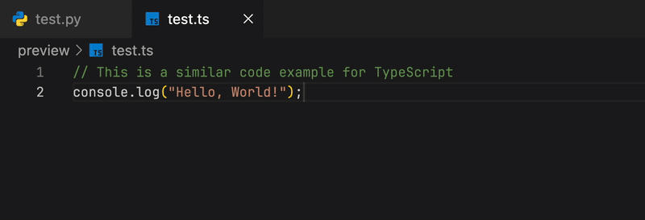
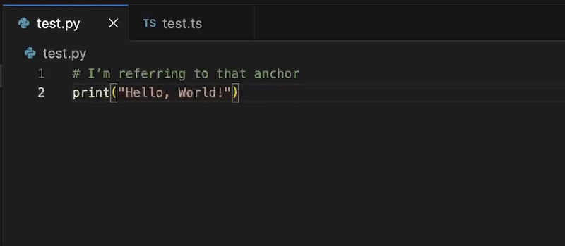
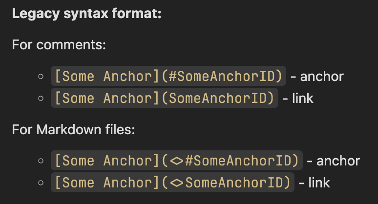

<h2 align="center">💬 Comment Linking extension for VS Code</h2>

<p align="center">
  
</p>

<p align="center">
  <a href="https://marketplace.visualstudio.com/items?itemName=kratiuk.commentlinking"></a>
  <a href="https://marketplace.visualstudio.com/items?itemName=kratiuk.commentlinking"></a>
  <a href="https://marketplace.visualstudio.com/items?itemName=kratiuk.commentlinking"></a>
</p>

<p align="center">
  <a href="https://open-vsx.org/extension/kratiuk/commentlinking"></a>
  <a href="https://open-vsx.org/extension/kratiuk/commentlinking"></a>
  <a href="https://open-vsx.org/extension/kratiuk/commentlinking"></a>
</p>

<p align="center">
  <a href="https://github.com/kratiuk/commentlinking/blob/master/LICENSE"></a>
</p>

<p align="center">
  <code>🔗 Link between comments in code. Create anchors and jump to them from anywhere</code>
</p>

---

<h3 align="center">🎬 Examples</h3>

#### 🧠 How it works

- Add an anchor comment where you want to jump to: `[[AnchorID|Some anchor]]`
- Reference it elsewhere: `[[#AnchorID|Go to anchor]]`
- Click the link while holding Ctrl (Cmd on macOS) to jump to the anchor. The Anchors view shows all anchors across your workspace

- Basic Link ↔ Anchor interaction:

  

- Anchors view (tree of all anchors):

  _Note: This demo shows the legacy anchor syntax_
  

  <details>
  <summary>Click to see legacy syntax demo<br/>
  (enable <code>commentLinking.enableLegacySyntax</code> in settings)</summary>

  

  

  </details>

<h3 align="center">✨ Features</h3>

- 🔍 Anchors tree view to browse anchors across files
- 🎯 Inline links in comments that jump to anchors
- 🖍️ Smart decorations to highlight only the preview text
- 📋 Copy anchor ID from the Anchors view

<h3 align="center">✅ Supported languages and file formats</h3>

- `C` (.c)
- `C#` (.cs)
- `C++` (.cpp, .cxx, .cc, .hpp, .h)
- `Clojure` (.clj, .cljs, .cljc)
- `CSS` (.css, .scss, .sass, .less)
- `Dart` (.dart)
- `Dockerfile` (Dockerfile, dockerfile, Dockerfile.\*)
- `Go` (.go)
- `HTML` (.html, .htm) - supports `HTML`, `JavaScript`, and `CSS` comments
- `Java` (.java)
- `JavaScript` (.js)
- `JavaScript React` (.jsx)
- `JSON` (.json)
- `JSON With Comments` (.jsonc)
- `Kotlin` (.kt, .kts)
- `Makefile` (Makefile, makefile, .mk)
- `Markdown` (.md) - full text support (legacy syntax requires special format)
- `PHP` (.php)
- `PowerShell` (.ps1, .psm1, .psd1)
- `Python` (.py)
- `Ruby` (.rb)
- `Rust` (.rs)
- `Shell` (.sh, .bash, .zsh)
- `Svelte` (.svelte)
- `Swift` (.swift)
- `TOML` (.toml)
- `TypeScript` (.ts)
- `TypeScript React` (.tsx)
- `Vue` (.vue)
- `XML` (.xml)
- `YAML` (.yaml, .yml)

<h3 align="center">⚙️ Custom File Types</h3>

You can extend support to any file type by configuring custom comment syntax in VS Code settings:

**Open Settings** → Search for `commentLinking.customFileTypes` **OR** directly edit your `settings.json` file

```json
{
  "commentLinking.customFileTypes": {
    ".pde": "js"
  }
}
```

**Configuration format:**

- **Key** (e.g. `".vue"`) - File extension to add support for
- **Value** - Comment syntax type to use:
  - `"js"` - Uses `//` comments (like JavaScript/TypeScript)
  - `"python"` - Uses `#` comments (like Python/Shell)

<h3 align="center">📂 Indexing scope & exclusions</h3>

- Scans all workspace folders for supported file extensions
- **Gitignore support**: Uses `.gitignore` patterns by default (disable via `commentLinking.useGitignore` setting)
- **Custom exclusions**: Create `.commentlinkingignore` file in project root to exclude additional files/directories
- **Priority**: `.commentlinkingignore` takes precedence over `.gitignore` patterns

<h3 align="center">📦 Installation</h3>

1. Install the extension
2. Reload `VS Code` window (you'll be prompted on first install)

### 📊 Debugging & Logging

To view detailed indexing logs and performance information:

1. Open VS Code Output panel (`View > Output`)
2. Select "Comment Linking" from the dropdown
3. Watch real-time indexing progress and timing information

<h3 align="center">🧪 Development & Testing</h3>

To test changes during development:

1. Press `F5` to launch Extension Development Host
2. Make changes to the code and save
3. In the test window, run `Developer: Reload Window` to see updates

To build and install the extension manually:

1. Install all dependencies: `pnpm install`
2. Build the extension package: `pnpm package`
3. Install the generated `.vsix` file in VS Code: `Extensions > Install from VSIX...`

<h3 align="center">✅ Roadmap / To‑Do</h3>

- [ ] 📖 Create Markdown preview with link and anchor support
- [ ] 🔗 Add support for creating anchors and links without preview text in backlinks
- [ ] 🔀 Add sorting by line numbers in anchor tree view
- [ ] ⚙️ Add support for custom comment types for specific files
- [ ] 🎨 Add functionality to configure anchor and link styles
- [ ] 🔄 Add functionality to disable new syntax if users want to use only legacy syntax
- [ ] 🏷️ Add button in anchor tree to toggle between displaying anchor IDs and preview text
- [ ] 🔍 Add support for displaying all links to a specific anchor in the editor
- [ ] 📚 Add and host comprehensive documentation
- [x] 🧵 Support multiline comments (block and triple-quote styles)
- [x] 🌐 Add more languages (e.g., `Go`, `Rust`) and support `.jsx/.tsx`
- [x] 📁 Add support for using `.gitignore` file as default exclusion file

---

Made with 😡 by [Viktor Kratiuk](https://github.com/kratiuk)
