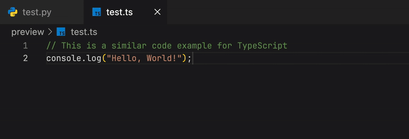
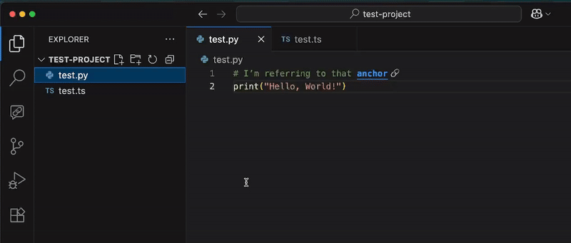
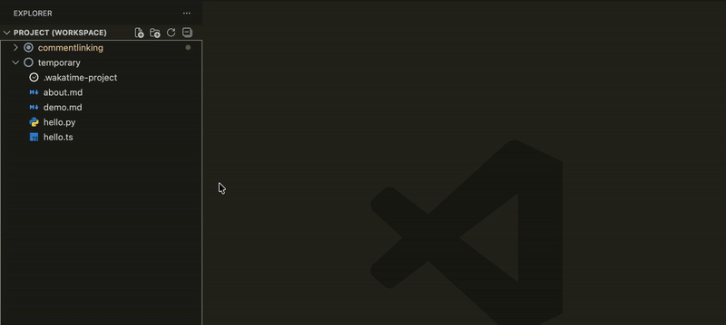

<h2 align="center">💬 Comment Linking extension for VS Code</h2>

<p align="center">
  
</p>

<p align="center">
  <a href="https://marketplace.visualstudio.com/items?itemName=kratiuk.commentlinking"></a>
  <a href="https://marketplace.visualstudio.com/items?itemName=kratiuk.commentlinking"></a>
  <a href="https://marketplace.visualstudio.com/items?itemName=kratiuk.commentlinking"></a>
</p>

<p align="center">
  <a href="https://open-vsx.org/extension/kratiuk/commentlinking"></a>
  <a href="https://open-vsx.org/extension/kratiuk/commentlinking"></a>
  <a href="https://open-vsx.org/extension/kratiuk/commentlinking"></a>
</p>

<p align="center">
  <a href="https://github.com/kratiuk/commentlinking/blob/master/LICENSE"></a>
</p>

<p align="center">
  <code>🔗 Link between comments in code. Create anchors and jump to them from anywhere</code>
</p>

---

<h3 align="center">🎬 Examples</h3>

#### 🧠 How it works

- Add an anchor comment where you want to jump to: `[[AnchorID|Some anchor]]`
- Reference it elsewhere: `[[#AnchorID|Go to anchor]]`
- Click the link while holding Ctrl (Cmd on macOS) to jump to the anchor. The Anchors view shows all anchors across your workspace

- Basic Link ↔ Anchor interaction:

  

- Anchors view (tree of all anchors):

  _Note: This demo shows the legacy anchor syntax_
  

- Markdown Preview with anchors and links support:

  

  > ✨ Supports back/forward navigation, live reload on file changes, and opens linked Markdown files within the same preview

---

<h3 align="center">✨ Features</h3>

- 🔍 Anchors tree view to browse anchors across files
- 🎯 Inline links in comments that jump to anchors
- 🖍️ Smart decorations to highlight only the preview text
- 📋 Copy anchor ID from the Anchors view
- 📖 Markdown Preview with anchors and links support
- 🙈 Ignore files on all levels (`.gitignore`, `.commentlinkingignore`, `.git/.commentlinkingignore`)

---

<h3 align="center">✅ Supported languages and file formats</h3>

- `C` (.c)
- `C#` (.cs)
- `C++` (.cpp, .cxx, .cc, .hpp, .h)
- `Clojure` (.clj, .cljs, .cljc)
- `CSS` (.css, .scss, .sass, .less)
- `Dart` (.dart)
- `Dockerfile` (Dockerfile, dockerfile, Dockerfile.\*)
- `Go` (.go)
- `HTML` (.html, .htm) - supports `HTML`, `JavaScript`, and `CSS` comments
- `Java` (.java)
- `JavaScript` (.js)
- `JavaScript React` (.jsx)
- `JSON` (.json)
- `JSON With Comments` (.jsonc)
- `Kotlin` (.kt, .kts)
- `Makefile` (Makefile, makefile, .mk)
- `Markdown` (.md) - full text support
- `PHP` (.php)
- `PowerShell` (.ps1, .psm1, .psd1)
- `Python` (.py)
- `Ruby` (.rb)
- `Rust` (.rs)
- `Shell` (.sh, .bash, .zsh)
- `Svelte` (.svelte)
- `Swift` (.swift)
- `TOML` (.toml)
- `TypeScript` (.ts)
- `TypeScript React` (.tsx)
- `Vue` (.vue)
- `XML` (.xml)
- `YAML` (.yaml, .yml)

---

<h3 align="center">📂 Indexing scope & exclusions</h3>

- Scans all workspace folders for supported file extensions

<h4 align="center">🙈 Supported ignore files</h4>

| File                         | Works      | Priority | Note                                              |
| ---------------------------- | ---------- | -------- | ------------------------------------------------- |
| `.gitignore`                 | by default | lowest   | Disable via `commentLinking.useGitignore` setting |
| `.commentlinkingignore`      | always     | medium   | Project-level exclusions                          |
| `.git/.commentlinkingignore` | always     | highest  | Local exclusions, not tracked by git              |

---

<h3 align="center">📦 Installation</h3>

- Search for `Comment Linking` in VS Code Marketplace and install
- Reload `VS Code` window (you'll be prompted on first install)

<br>

To install a manually built version (Snapshot Build):

> ⚠️ This requires `Node.js` and `pnpm` installed on your machine

```bash
git clone https://github.com/kratiuk/commentlinking.git
cd commentlinking
pnpm install
pnpm package # This will generate a .vsix file
```

Then in VS Code: `Extensions` → `...` → `Install from VSIX...` and select the generated file

---

<h3 align="center">📊 Debugging & Logging</h3>

To view detailed indexing logs and performance information:

1. Open VS Code Output panel (`View > Output`)
2. Select "Comment Linking" from the dropdown
3. Watch real-time indexing progress and timing information

---

<h3 align="center">🤝 Contributing</h3>

See [CONTRIBUTING.md](./CONTRIBUTING.md) for setup, workflows, and guidelines

---

<h3 align="center">✅ Roadmap / To‑Do</h3>

- [ ] 🔗 Add support for creating anchors and links without preview text in backlinks
- [ ] 🔀 Add sorting by line numbers in anchor tree view
- [ ] ⚙️ Add support for custom comment types for specific files
- [ ] 🎨 Add functionality to configure anchor and link styles
- [ ] 🏷️ Add button in anchor tree to toggle between displaying anchor IDs and preview text
- [ ] 🔍 Add support for displaying all links to a specific anchor in the editor
- [ ] 📚 Add and host comprehensive documentation
- [x] 📖 Create Markdown preview with link and anchor support
- [x] 🧵 Support multiline comments (block and triple-quote styles)
- [x] 🌐 Add more languages (e.g., `Go`, `Rust`) and support `.jsx/.tsx`
- [x] 📁 Add support for using `.gitignore` file as default exclusion file

---

<p align="center">Made with 😡 by <a href="https://github.com/kratiuk">Viktor Kratiuk</a></p>
